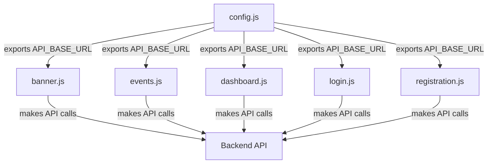

# Design Document: Centralized API Configuration

## Overview

This design implements a centralized API configuration system for the AECAS frontend application. Currently, the backend API URL is hardcoded in multiple JavaScript files (banner.js and events.js use the old URL `https://member-management-system-e52u.onrender.com`, while dashboard.js, login.js, and registration.js use relative URLs like `/api/...`). This fragmentation caused CORS errors when the backend URL changed to `https://aecas.onrender.com`.

The solution introduces a single configuration module (`frontend/js/config.js`) that exports the backend base URL. This module automatically detects the environment (local vs production) and provides the appropriate URL. All frontend modules will import and use this centralized configuration, ensuring consistency and making future URL updates trivial.

### Key Benefits

- Single source of truth for backend API URL
- Automatic environment detection (localhost vs production)
- Easy maintenance - update URL in one place
- Prevents CORS errors from URL mismatches
- Backward compatible with existing code patterns

## Architecture

### Component Structure

```
frontend/js/
├── config.js           (NEW - centralized configuration)
├── banner.js           (MODIFIED - import config)
├── events.js           (MODIFIED - import config)
├── dashboard.js        (MODIFIED - import config)
├── login.js            (MODIFIED - import config)
└── registration.js     (MODIFIED - import config)
```

### Module Dependencies



### Environment Detection Logic

The configuration module uses `window.location.hostname` to determine the environment:

- **Local Development**: hostname is `localhost` or `127.0.0.1` → use `http://localhost:3000/api`
- **Production**: any other hostname → use `https://aecas.onrender.com/api`

This approach is simple, reliable, and requires no manual configuration changes when deploying.

## Components and Interfaces

### 1. Configuration Module (config.js)

**Purpose**: Provide centralized API base URL with automatic environment detection

**Exports**:
- `API_BASE_URL` (string): The complete base URL for API calls including `/api` path

**Implementation Pattern**:
```javascript
// Environment detection
const isLocalhost = window.location.hostname === 'localhost' || 
                    window.location.hostname === '127.0.0.1';

// Export base URL
export const API_BASE_URL = isLocalhost 
    ? 'http://localhost:3000/api'
    : 'https://aecas.onrender.com/api';
```

**Design Decisions**:
- Uses ES6 module syntax for modern JavaScript compatibility
- Includes `/api` in the base URL to match existing patterns
- Executes detection at module load time (no runtime overhead)
- Provides clear comments for future maintainers

### 2. Frontend Module Integration

Each frontend module will be updated to:

1. Import the configuration at the top of the file
2. Replace hardcoded URLs with the imported `API_BASE_URL`
3. Construct full endpoint URLs by appending paths to `API_BASE_URL`

**Integration Pattern**:

**Before** (banner.js):
```javascript
const BANNER_API_URL = window.location.hostname === 'localhost' 
    ? 'http://localhost:3000/api' 
    : 'https://member-management-system-e52u.onrender.com/api';

fetch(`${BANNER_API_URL}/banners/active`)
```

**After** (banner.js):
```javascript
import { API_BASE_URL } from './config.js';

fetch(`${API_BASE_URL}/banners/active`)
```

**Before** (events.js):
```javascript
const API_URL = window.location.hostname === 'localhost' 
    ? 'http://localhost:3000/api' 
    : 'https://member-management-system-e52u.onrender.com/api';

fetch(`${API_URL}/events/public`)
```

**After** (events.js):
```javascript
import { API_BASE_URL } from './config.js';

fetch(`${API_BASE_URL}/events/public`)
```

**Before** (dashboard.js, login.js, registration.js):
```javascript
fetch('/api/members')
```

**After** (dashboard.js, login.js, registration.js):
```javascript
import { API_BASE_URL } from './config.js';

fetch(`${API_BASE_URL}/members`)
```

### 3. HTML Module Loading

Since the frontend uses ES6 modules, HTML files that load these JavaScript files must use `type="module"`:

**Pattern**:
```html
<script type="module" src="js/banner.js"></script>
<script type="module" src="js/events.js"></script>
<script type="module" src="js/dashboard.js"></script>
<script type="module" src="js/login.js"></script>
<script type="module" src="js/registration.js"></script>
```

This enables the `import` statements to work correctly in the browser.

## Data Models

### Configuration Object

```typescript
interface APIConfig {
    API_BASE_URL: string;  // e.g., "https://aecas.onrender.com/api"
}
```

**Constraints**:
- `API_BASE_URL` must be a valid URL string
- Must include the `/api` path segment
- Must not have a trailing slash
- Must use `http://` for localhost, `https://` for production

### Environment Detection

```typescript
interface Environment {
    hostname: string;      // window.location.hostname
    isLocalhost: boolean;  // true if localhost or 127.0.0.1
}
```

## Correctness Properties

*A property is a characteristic or behavior that should hold true across all valid executions of a system—essentially, a formal statement about what the system should do. Properties serve as the bridge between human-readable specifications and machine-verifiable correctness guarantees.*


### Property 1: URL Construction Consistency

*For any* API endpoint path, when a frontend module makes an API call, the full URL SHALL be constructed by appending the endpoint path to API_BASE_URL (e.g., `${API_BASE_URL}/banners/active`).

**Validates: Requirements 2.6, 3.2**

### Property 2: Production Environment Detection

*For any* hostname value that is not 'localhost' or '127.0.0.1', the API_BASE_URL SHALL be set to the production URL 'https://aecas.onrender.com/api'.

**Validates: Requirements 5.2**

## Error Handling

### Configuration Module Errors

The configuration module is designed to be fail-safe:

1. **Missing window.location**: If `window.location.hostname` is undefined (unlikely in browser context), the module defaults to production URL for safety
2. **Invalid hostname**: Any hostname value is valid; the module simply checks if it matches localhost patterns

### Frontend Module Errors

Frontend modules should handle API call failures gracefully:

1. **Network errors**: Existing error handling in fetch calls remains unchanged
2. **CORS errors**: Should be eliminated by using the correct backend URL
3. **Import errors**: If config.js fails to load, the module will throw an error at load time (fail-fast behavior)

### Debugging

To verify the correct URL is being used:

```javascript
// Add to browser console
import { API_BASE_URL } from './js/config.js';
console.log('Current API Base URL:', API_BASE_URL);
```

## Testing Strategy

### Dual Testing Approach

This feature requires both unit tests and property-based tests to ensure comprehensive coverage:

- **Unit tests**: Verify specific examples, edge cases, and module structure
- **Property tests**: Verify universal properties across all inputs

Together, these approaches provide comprehensive coverage where unit tests catch concrete bugs and property tests verify general correctness.

### Unit Testing

Unit tests should focus on specific examples and edge cases:

**Configuration Module Tests** (config.test.js):
1. Verify API_BASE_URL is exported and is a string
2. Test localhost detection: mock hostname as 'localhost', verify URL is 'http://localhost:3000/api'
3. Test 127.0.0.1 detection: mock hostname as '127.0.0.1', verify URL is 'http://localhost:3000/api'
4. Test production detection: mock hostname as 'example.com', verify URL is 'https://aecas.onrender.com/api'
5. Verify URL structure: check that API_BASE_URL ends with '/api' and has no trailing slash
6. Verify environment detection executes at module load time

**Frontend Module Integration Tests**:
1. Verify banner.js imports API_BASE_URL from config.js
2. Verify events.js imports API_BASE_URL from config.js
3. Verify dashboard.js imports API_BASE_URL from config.js
4. Verify login.js imports API_BASE_URL from config.js
5. Verify registration.js imports API_BASE_URL from config.js
6. Verify old hardcoded URLs are removed from banner.js and events.js
7. Verify config.js exists at frontend/js/config.js
8. Verify config.js contains documentation comments

### Property-Based Testing

Property tests should verify universal behaviors across many generated inputs. Use a property-based testing library for JavaScript (e.g., fast-check, jsverify).

**Configuration**: Each property test should run a minimum of 100 iterations to ensure comprehensive input coverage.

**Property Test 1: URL Construction Consistency**
- **Tag**: Feature: centralized-api-config, Property 1: For any API endpoint path, when a frontend module makes an API call, the full URL SHALL be constructed by appending the endpoint path to API_BASE_URL
- **Test**: Generate random endpoint paths (e.g., '/members', '/events/123', '/banners/active')
- **Verify**: For each path, `${API_BASE_URL}${path}` produces a valid URL that starts with API_BASE_URL
- **Validates**: Requirements 2.6, 3.2

**Property Test 2: Production Environment Detection**
- **Tag**: Feature: centralized-api-config, Property 2: For any hostname value that is not 'localhost' or '127.0.0.1', the API_BASE_URL SHALL be set to the production URL
- **Test**: Generate random hostname strings (excluding 'localhost' and '127.0.0.1')
- **Verify**: For each hostname, when mocked as window.location.hostname, API_BASE_URL equals 'https://aecas.onrender.com/api'
- **Validates**: Requirements 5.2

### Integration Testing

After implementation, perform manual integration testing:

1. **Local Development**: Run application on localhost, verify API calls go to http://localhost:3000/api
2. **Production**: Deploy to production, verify API calls go to https://aecas.onrender.com/api
3. **Browser Console**: Check for CORS errors (should be none)
4. **Network Tab**: Verify all API requests use the correct base URL
5. **Functionality**: Test all features (login, registration, events, banners, dashboard) work correctly

### Test Coverage Goals

- Configuration module: 100% line coverage
- Frontend module imports: Verify all 5 modules import config
- URL construction: Verify all fetch calls use API_BASE_URL
- Environment detection: Test both localhost and production scenarios

## Implementation Notes

### Migration Steps

1. Create `frontend/js/config.js` with environment detection logic
2. Update `banner.js`: import config, replace BANNER_API_URL with API_BASE_URL
3. Update `events.js`: import config, replace API_URL with API_BASE_URL
4. Update `dashboard.js`: import config, replace relative URLs with API_BASE_URL
5. Update `login.js`: import config, replace relative URLs with API_BASE_URL
6. Update `registration.js`: import config, replace relative URLs with API_BASE_URL
7. Update HTML files to use `type="module"` for script tags
8. Test locally and in production

### Backward Compatibility

The implementation maintains backward compatibility:

- URL structure remains identical (includes `/api` path)
- Endpoint paths are appended the same way
- No changes to API request/response formats
- Existing error handling remains unchanged

### Future Enhancements

Possible future improvements:

1. **Environment variable support**: Read URLs from environment variables for more flexibility
2. **Multiple environments**: Support staging, QA, and other environments
3. **API versioning**: Include version in base URL (e.g., `/api/v1`)
4. **Configuration validation**: Add runtime checks to ensure URLs are valid
5. **Logging**: Add optional logging to track which URL is being used

### Performance Considerations

- Environment detection happens once at module load time (no runtime overhead)
- No additional network requests
- Minimal memory footprint (single string constant)
- No impact on existing API call performance

## Deployment Checklist

Before deploying this feature:

- [ ] Create config.js with correct production URL
- [ ] Update all 5 frontend modules to import config
- [ ] Remove old hardcoded URLs
- [ ] Update HTML files to use module script tags
- [ ] Test locally with backend running on localhost:3000
- [ ] Verify no console errors or CORS issues
- [ ] Deploy to production
- [ ] Verify production API calls use correct URL
- [ ] Test all features in production environment
- [ ] Monitor for any errors in production logs
