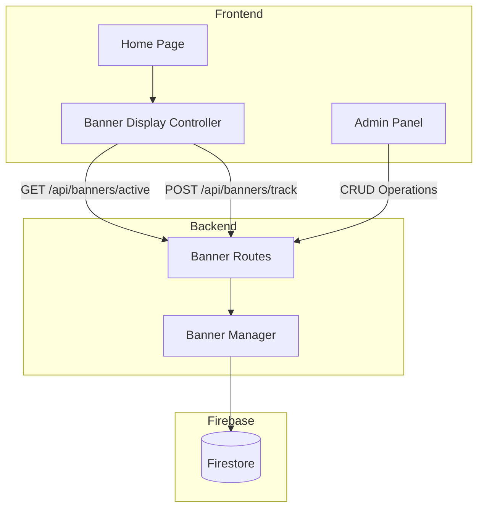

# Design Document: Promotional Banner System

## Overview

The promotional banner system provides a complete solution for displaying promotional content to AECAS website visitors. The system consists of a backend API for banner management (CRUD operations, scheduling, analytics) and a frontend component for rendering banners as modal overlays.

The architecture follows the existing patterns in the AECAS codebase:
- Backend: Express.js routes with Firebase Firestore for data persistence
- Frontend: Vanilla JavaScript with CSS for the modal overlay
- Admin: Integration with the existing admin.html dashboard

## Architecture



### Data Flow

1. **Banner Creation Flow**: Admin Panel → POST /api/banners → Banner Manager → Firebase
2. **Banner Display Flow**: Page Load → GET /api/banners/active → Filter by date/status → Display Controller → Render Modal
3. **Analytics Flow**: User Click → POST /api/banners/track → Increment counters in Firebase

## Components and Interfaces

### Backend Components

#### Banner Routes (`backend/routes/banners.js`)

```javascript
// Public endpoints (no auth required)
GET  /api/banners/active     // Get active banners for display
POST /api/banners/track      // Track impressions and clicks

// Protected endpoints (admin/communications role required)
GET    /api/banners          // List all banners
POST   /api/banners          // Create new banner
PUT    /api/banners/:id      // Update banner
DELETE /api/banners/:id      // Delete banner
```

#### Banner Manager Functions

```javascript
// Create a new banner
async function createBanner(bannerData, createdBy) → { success: boolean, bannerId: string }

// Get all banners (admin view)
async function getAllBanners() → Banner[]

// Get active banners (public view)
async function getActiveBanners() → Banner[]

// Update banner
async function updateBanner(id, updateData, updatedBy) → { success: boolean }

// Delete banner
async function deleteBanner(id) → { success: boolean }

// Track analytics event
async function trackBannerEvent(bannerId, eventType) → { success: boolean }
```

### Frontend Components

#### Banner Display Controller (`frontend/js/banner.js`)

```javascript
// Initialize banner system on page load
function initBannerSystem()

// Fetch active banners from API
async function fetchActiveBanners() → Banner[]

// Check if banner should display (session/frequency logic)
function shouldDisplayBanner(banner) → boolean

// Render banner modal
function renderBanner(banner)

// Handle banner close
function closeBanner(bannerId)

// Handle banner click (redirect + track)
function handleBannerClick(banner)

// Track impression/click events
async function trackEvent(bannerId, eventType)
```

#### Banner Modal Styles (`frontend/css/banner.css`)

- `.banner-overlay` - Full-screen semi-transparent backdrop
- `.banner-modal` - Centered modal container
- `.banner-close` - Close button (X)
- `.banner-content` - Content wrapper
- `.banner-image` - Optional image display
- `.banner-title` - Banner title text
- `.banner-description` - Banner description text

### Admin Panel Integration

Add a new section to `admin.html` for banner management:
- Banner list table with status indicators
- Create/Edit banner form modal
- Analytics display (impressions, clicks, CTR)

## Data Models

### Banner Schema (Firebase Document)

```javascript
{
  id: string,                    // Firebase document ID
  title: string,                 // Required - Banner title
  description: string,           // Optional - Banner description
  imageUrl: string,              // Optional - Image URL
  redirectUrl: string,           // Required - Click destination URL
  
  // Scheduling
  startDate: string | null,      // ISO date string, null = immediate
  endDate: string | null,        // ISO date string, null = indefinite
  
  // Display configuration
  displayDuration: number,       // Seconds before auto-close (default: 10)
  displayFrequency: string,      // "once_per_session" | "every_visit"
  
  // Status
  active: boolean,               // Admin toggle for enabling/disabling
  
  // Analytics
  impressions: number,           // View count
  clicks: number,                // Click count
  
  // Metadata
  createdAt: string,             // ISO timestamp
  createdBy: string,             // Admin username
  updatedAt: string | null,      // ISO timestamp
  updatedBy: string | null       // Admin username
}
```

### Session Storage Key

```javascript
// Key format for tracking displayed banners in session
`aecas_banner_shown_${bannerId}` → "true"
```

### API Response Formats

#### GET /api/banners/active Response
```javascript
{
  success: true,
  banners: Banner[]
}
```

#### POST /api/banners Request Body
```javascript
{
  title: string,
  description?: string,
  imageUrl?: string,
  redirectUrl: string,
  startDate?: string,
  endDate?: string,
  displayDuration?: number,
  displayFrequency?: string
}
```

#### POST /api/banners/track Request Body
```javascript
{
  bannerId: string,
  eventType: "impression" | "click"
}
```


## Correctness Properties

*A property is a characteristic or behavior that should hold true across all valid executions of a system—essentially, a formal statement about what the system should do. Properties serve as the bridge between human-readable specifications and machine-verifiable correctness guarantees.*

### Property 1: Banner Serialization Round-Trip

*For any* valid banner object, serializing it to JSON for Firebase storage and then deserializing it back SHALL produce an equivalent banner object with all fields preserved.

**Validates: Requirements 1.2, 8.2, 8.3, 8.4**

### Property 2: Date Range Filtering

*For any* banner with a start date and/or end date, and *for any* current timestamp:
- If current time is before start date, the banner SHALL NOT be returned by getActiveBanners
- If current time is after end date, the banner SHALL NOT be returned by getActiveBanners
- If current time is between start and end dates (inclusive), the banner SHALL be eligible for display

**Validates: Requirements 2.1, 2.2, 2.3, 6.2**

### Property 3: Active Flag Filtering

*For any* set of banners with varying active flags, getActiveBanners SHALL return only banners where active is true.

**Validates: Requirements 6.1**

### Property 4: Creation Date Ordering

*For any* set of active banners returned by getActiveBanners, the banners SHALL be ordered by createdAt timestamp in descending order (newest first).

**Validates: Requirements 6.3**

### Property 5: Session Frequency Tracking

*For any* banner with displayFrequency "once_per_session", after the banner has been marked as shown in session storage, shouldDisplayBanner SHALL return false for that banner.

**Validates: Requirements 3.2**

### Property 6: Every-Visit Frequency Bypass

*For any* banner with displayFrequency "every_visit", shouldDisplayBanner SHALL return true regardless of session storage state.

**Validates: Requirements 3.3**

### Property 7: Update Persistence

*For any* banner and *for any* valid update data, after calling updateBanner, retrieving the banner SHALL return the updated values and the updatedAt timestamp SHALL be set.

**Validates: Requirements 4.1, 4.3**

### Property 8: Delete Removes Banner

*For any* existing banner, after calling deleteBanner, attempting to retrieve that banner SHALL fail or return null.

**Validates: Requirements 4.2**

### Property 9: Analytics Counter Increment

*For any* banner and *for any* sequence of N track events of the same type (impression or click), the corresponding counter SHALL increase by exactly N.

**Validates: Requirements 7.2**

### Property 10: Validation Rejects Missing Required Fields

*For any* banner creation request missing the title field, createBanner SHALL reject the request and return a validation error.

**Validates: Requirements 1.3**

### Property 11: Metadata Auto-Population

*For any* successfully created banner, the banner SHALL have createdAt timestamp and createdBy username populated automatically.

**Validates: Requirements 1.4**

## Error Handling

### Backend Error Handling

| Error Condition | HTTP Status | Response |
|----------------|-------------|----------|
| Missing required fields (title, redirectUrl) | 400 | `{ error: "Title and redirect URL are required" }` |
| Banner not found | 404 | `{ error: "Banner not found" }` |
| Invalid date format | 400 | `{ error: "Invalid date format" }` |
| Firebase operation failure | 500 | `{ error: "Failed to [operation] banner" }` |
| Unauthorized access | 401 | `{ error: "Unauthorized" }` |
| Insufficient permissions | 403 | `{ error: "Forbidden" }` |

### Frontend Error Handling

- **API fetch failure**: Log error to console, fail silently (don't block page load)
- **Invalid banner data**: Skip rendering that banner, continue with others
- **Session storage unavailable**: Fall back to showing banner every time
- **Image load failure**: Hide image container, show text content only

## Testing Strategy

### Unit Tests

Unit tests should cover specific examples and edge cases:

1. **Banner validation**
   - Empty title rejection
   - Empty redirect URL rejection
   - Valid banner creation

2. **Date handling edge cases**
   - Null start date (immediately active)
   - Null end date (indefinitely active)
   - Start date equals end date
   - Timezone handling

3. **Default value assignment**
   - displayDuration defaults to 10
   - displayFrequency defaults to "once_per_session"

4. **Session storage**
   - Storage key format
   - Storage unavailable fallback

### Property-Based Tests

Property-based tests should use a library like `fast-check` for JavaScript. Each test should run a minimum of 100 iterations.

**Test Configuration:**
- Library: fast-check
- Minimum iterations: 100
- Tag format: `Feature: promotional-banner, Property N: [property description]`

**Generator Requirements:**
- Banner generator: produces valid banner objects with random but valid field values
- Date generator: produces ISO date strings within reasonable range
- Update data generator: produces partial banner objects for updates

**Properties to implement:**
1. Round-trip serialization (Property 1)
2. Date range filtering (Property 2)
3. Active flag filtering (Property 3)
4. Creation date ordering (Property 4)
5. Session frequency tracking (Property 5)
6. Every-visit frequency bypass (Property 6)
7. Update persistence (Property 7)
8. Delete removes banner (Property 8)
9. Analytics counter increment (Property 9)
10. Validation rejects missing fields (Property 10)
11. Metadata auto-population (Property 11)

### Integration Tests

- Full CRUD flow through API endpoints
- Banner display flow from page load to modal render
- Analytics tracking end-to-end
